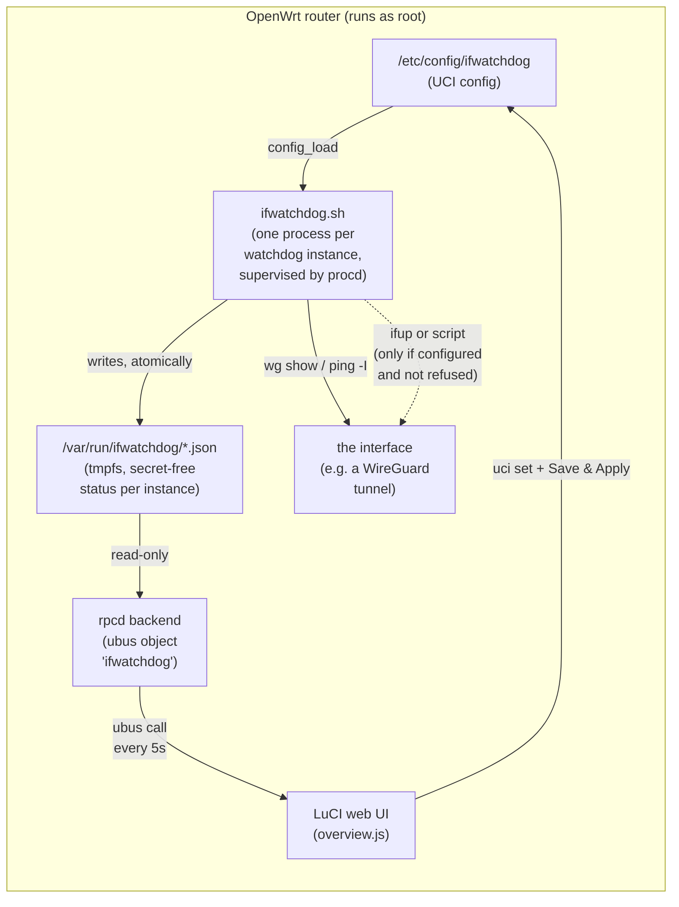
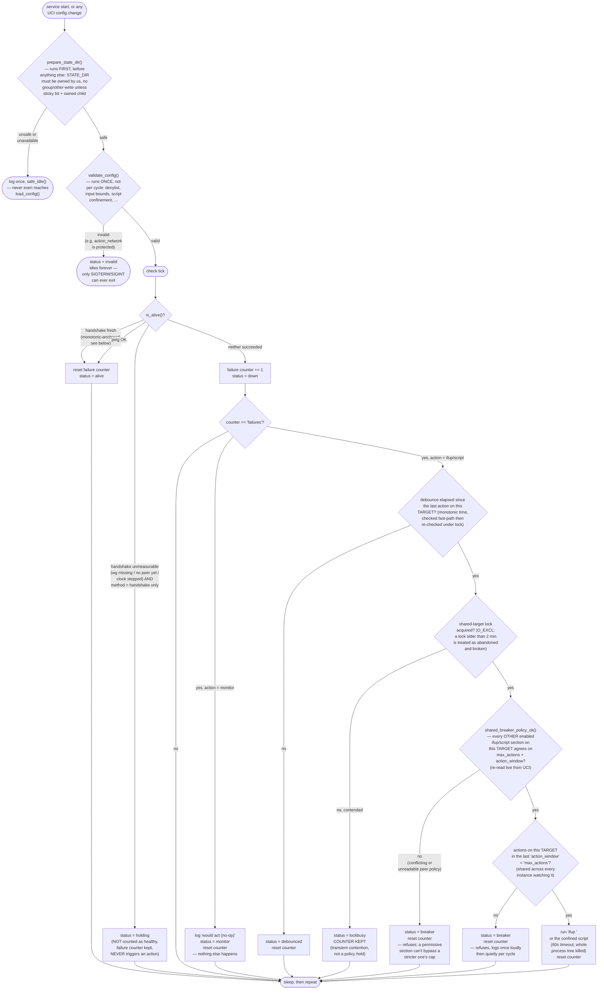

# How `ifwatchdog` works

**Audience:** anyone who needs to evaluate whether this is safe to run as `root` on a router they
depend on, without reading the shell script line by line. For the full design rationale and every
option's meaning, see [`SPEC.md`](SPEC.md); for what was actually verified, see
[`REVIEW-claude-web.md`](REVIEW-claude-web.md) and [`UAT.md`](UAT.md).

## What it does, in one sentence

Once per configured interval, one shell process per watched interface asks "is this tunnel actually
alive?" via a WireGuard handshake age and/or an interface-bound ping; if the answer is "no" for several
checks in a row, it **logs** that fact — and only if you have explicitly configured an action, it
restarts the interface (or runs a script), subject to a debounce delay and a hard cap on how many times
it may do that in a rolling time window.

## Components

- **`ifwatchdog.sh`** does all the real work. `procd` starts one instance of it per UCI `config
  watchdog` section, restarts it if it ever crashes, and stops it on `service ifwatchdog stop`.
- **The status JSON files** are the *only* thing the GUI ever reads from the service — never raw log
  files, never a shared memory segment. Each is written atomically (write to a temp file, then `mv`),
  so the GUI can never see a half-written file.
- **The rpcd backend** is a ~15-line shell script that concatenates those JSON files into one ubus
  response. It has no write path at all — a compromised or buggy LuCI page cannot make it *do*
  anything, only read state.
- **The LuCI page** polls that ubus call every 5 seconds for the live-status table, and writes UCI
  config through the normal LuCI form mechanism (`Save` / `Save & Apply`) — the same path every other
  LuCI app uses, with no custom privilege escalation.

## The check loop (what happens every `interval` seconds)

Two things worth calling out explicitly because they are easy to get subtly wrong (and were tightened
over several review rounds — see `CHANGELOG.md`):

- **The denylist check happens once, at config load**, not "at the moment of acting". An instance whose
  `action_network` resolves to a protected interface never starts its action logic at all — it goes
  straight to a permanent `invalid` state. There is no code path where a *validated* action can still
  hit a protected target.
- **Detection is deliberately three-valued**, not a boolean: `fresh` / `stale` / `unknown`. `unknown`
  means "the check itself couldn't produce an answer" (no `wg` binary, interface absent, peer never
  handshaked, or the system clock just stepped backwards/forwards). With `method=handshake`, `unknown`
  **holds** — it is reported as `holding`, the failure counter is preserved but *never* advances toward
  an action, and it is never displayed as a false `alive`. This is the single most important property
  for trusting the watchdog: **it never acts on a signal it isn't sure about.**

## Why an admin can't lock themselves out

This is usually the first question a skeptical reviewer asks, so it gets its own section.

| Attack / mistake | What stops it |
|---|---|
| Admin (or a compromised LuCI session) sets `action_network=lan` | Refused at config load (glob match on the name) — instance goes `invalid`, never runs `ifup` |
| Admin renames LAN to `office` and creates a second network `office-mgmt` on the same bridge | Still refused — the check compares the *live* L3 device (via `ifstatus`, which correctly resolves UCI cross-references like `@lan`) against every network whose **name** matches a protected pattern, not just literally `lan` |
| A crafted UCI value like `action_network='-a'` (would become `ifup -a`, "bring up everything") | Rejected by input validation before it ever reaches a command line — any value starting with `-` fails validation outright |
| The tunnel has a genuine, non-transient outage (not a "stall") | `ifwatchdog` restarts the *tunnel interface*, not the uplink; a real WAN outage stays down exactly as it should (fail-closed intact) — restarting a healthy tunnel over a dead WAN is a no-op |
| A misconfigured instance causes repeated restarts ("flapping") | Debounce (minimum spacing between actions) **and** a circuit breaker (hard cap per rolling time window) both apply, keyed on the *target* network so multiple instances watching the same tunnel share one budget instead of multiplying it |
| The router reboots mid-outage, or an instance is `kill -9`'d | The breaker's bookkeeping uses **monotonic** time (`/proc/uptime`), immune to the wall-clock jump every router does at boot (no RTC); a leftover lock from a killed process is detected as stale and safely broken |
| An admin picks a bad config (e.g. `debounce=0` with a real action, or a nonexistent script) | Fails validation at startup → the instance idles and reports `invalid` in the GUI (not silently in syslog only) — it **never** guesses a safe default and proceeds |
| A custom `action=script` script hangs or is buggy | Bounded to 60 seconds and killed (including any child processes it spawned) — it can't block that instance's checks forever |

## What it never does

- Never runs `eval` on anything derived from configuration.
- Never logs or exposes a WireGuard private key, pre-shared key, or any other secret — status/log output
  is limited to ages, pass/fail states, and network *names* you already configured yourself.
- Never touches `wan` by default-deny (it's intentionally *not* on the protected list — restarting the
  uplink is a legitimate, common use) but also never touches anything matching `lan*`, `mgmt*`,
  `management*`, `admin`, `loopback`, or an admin-extended `protected_networks` list.
- Never treats "I couldn't measure this" the same as "this is healthy."

## Where the numbers come from

Nothing above is asserted from reading the code alone: `tests/run.sh` (198 automated checks, run without
any OpenWrt device) exercises every branch in this document directly against the real script — the
denylist table above, the debounce/breaker math, the fail-safe idle paths, and the script-kill-tree
behavior all have a corresponding test. The same behavior was then re-verified against a **real** OpenWrt
VM with a real WireGuard tunnel (see `UAT.md`), and again live on production hardware during staged
rollout.
